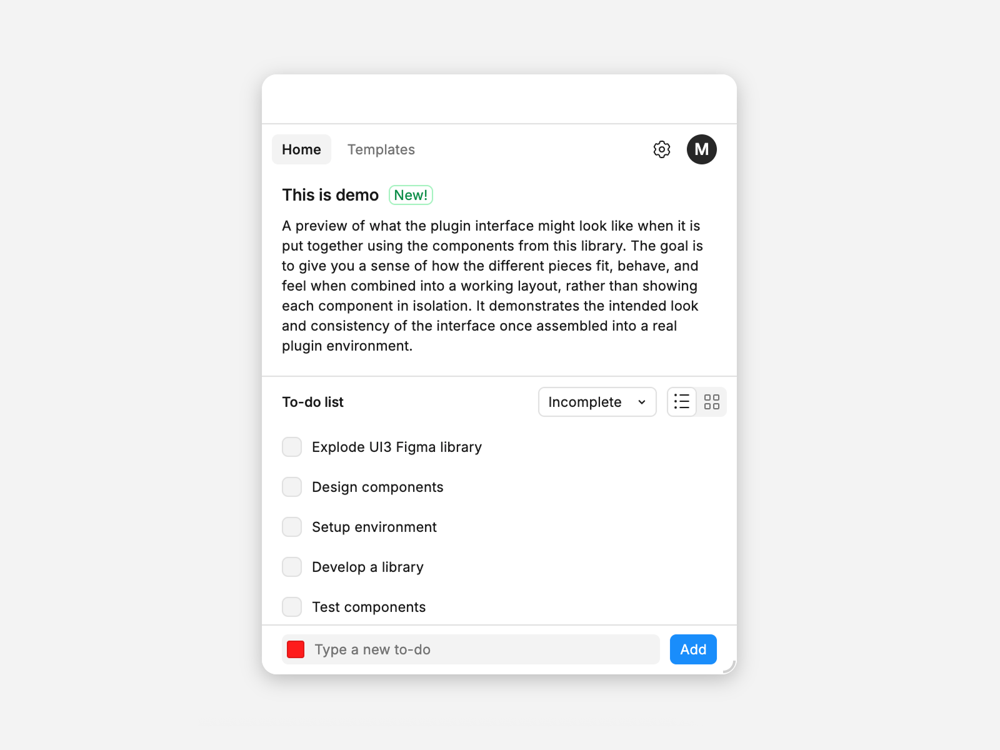

# Figma Plugin UI Library (Preact)

**An unofficial loose interpretation** of [Figma's UI3 design language](https://www.figma.com/community/file/1486123838948777078/ui3-figmas-ui-kit), adapted for plugin interfaces (Preact/React-compatible):

- Providing components and states relevant to plugin development.
- Optimizing the system for practical, real-world plugin workflows.
- Maintaining visual alignment with the current look & feel of Figma’s interface.

This project is an independent initiative and is not affiliated with or endorsed by [Figma](https://figma.com).

[Demo and documentation](https://canvastools.github.io/figma-plugin-preact-ui/) · [Canvas Tools](https://canvastools.io)



## Getting started

### Install

Use your preferred package manager. This library has peer dependencies on `preact` and `@preact/compat`.

```bash
npm install figma-plugin-preact-ui preact @preact/compat
# or
pnpm add figma-plugin-preact-ui preact @preact/compat
# or
yarn add figma-plugin-preact-ui preact @preact/compat
```

### Basic usage (consumer project)

Import the component(s) you need and the bundled CSS, then render with Preact. For **React**, use [`@preact/compat`](https://preactjs.com/guide/v10/switching-to-preact) so the same components run in React-based setups.

```tsx
import { render } from 'preact'
import { Button } from 'figma-plugin-preact-ui'
import 'figma-plugin-preact-ui/dist/themes.css'

function App() {
  return (
    <div class="app">
      <Button>Hello world!</Button>
    </div>
  )
}

render(<App />, document.getElementById('root')!)
```

### Types and tree‑shaking

The package ships ESM and TypeScript types. You can import prop types if needed:

```ts
import { Button } from 'figma-plugin-preact-ui'
import type { ButtonProps } from 'figma-plugin-preact-ui'
```

Components are individually exported from the entry, enabling tree‑shaking by modern bundlers.

CSS is emitted per component chunk: importing a component pulls in its styles automatically, as long as your bundler follows ESM imports. You still need **`themes.css`** so spacing, radius, and color variables (and the shared `body` / `#root` base rules) are defined.

```ts
import { Button } from 'figma-plugin-preact-ui'
import 'figma-plugin-preact-ui/dist/themes.css'
```

For a **single full stylesheet** (tokens + every component’s CSS), import **`style.css`** (not `styles.css`):

```ts
import { Button } from 'figma-plugin-preact-ui'
import 'figma-plugin-preact-ui/dist/style.css'
```

The CSS provides design tokens and component styles. Theming is controlled by the `.figma-light` or `.figma-dark` classes provided by Figma in the plugin window.

You can consume the CSS variables from the library directly.

In Storybook: [Overview](https://canvastools.github.io/figma-plugin-preact-ui/?path=/docs/overview-figma-plugin-ui--docs) and design tokens under **Variables**: [Spacing](https://canvastools.github.io/figma-plugin-preact-ui/?path=/docs/variables-spacing--docs), [Radius](https://canvastools.github.io/figma-plugin-preact-ui/?path=/docs/variables-radius--docs), [Colors](https://canvastools.github.io/figma-plugin-preact-ui/?path=/docs/variables-colors--docs).

#### CSS

```css
.card {
  padding: var(--pui-spacing-400);
  border-radius: var(--pui-radius-medium);
}

.title {
  color: var(--pui-color-neutral-text-default);
}
```

#### Inline styling

```ts
import { render } from 'preact'
import { Button } from 'figma-plugin-preact-ui'
import 'figma-plugin-preact-ui/dist/themes.css'

const style = {
  padding: 'var(--pui-spacing-400)',
  borderRadius: 'var(--pui-radius-medium)',
}

function App() {
  return (
    <div class="app" {...style}>
      <Button>Hello world!</Button>
    </div>
  )
}

render(<App />, document.getElementById('root')!)
```

#### JS variables

Theme objects expose the same values as CSS variables (nested keys mirror the token path). Numeric spacing scale keys must use bracket notation.

```ts
import { figmaLight, spacing, radius } from 'figma-plugin-preact-ui'
// Same nested `variables` shape: figmaDark, figjamLight

const surface = figmaLight.variables.neutral.bg.default // e.g. #FFFFFF (figma-light)
const titleColor = figmaLight.variables.neutral.text.default // matches var(--pui-color-neutral-text-default)
const pad = spacing.variables['400'] // "16px"
const round = radius.variables.medium // "5px"
```

#### Theming

Theming is tied to the `.figma-light` or `.figma-dark` classes provided by Figma in the plugin window.

You can add a class such as `.figjam` on the plugin root for the FigJam color theme (see `themes.css`).

Color variables are scoped under those classes in `themes.css`; spacing and radius live on `:root`.

#### Third-party UI building blocks

Some components wrap bundled dependencies (for example Calendar, ColorPicker, and TimePicker). You do not need to install those packages separately when using this library’s components.

## Changelog

All notable changes to this project are documented in [CHANGELOG.md](https://github.com/canvastools/figma-plugin-preact-ui/blob/main/CHANGELOG.md).

## License

Released under the [MIT License](https://github.com/canvastools/figma-plugin-preact-ui/blob/main/LICENSE.md).
